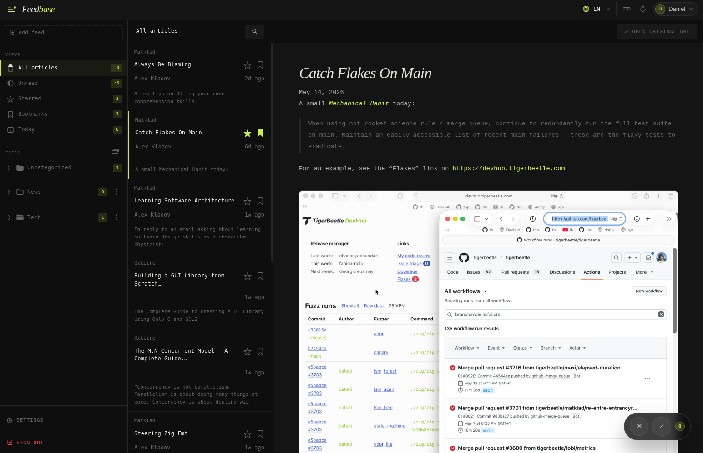

<!-- markdownlint-disable MD033 -->
<h1 align="center">
    <div style="display: flex; align-items: center; justify-content: center; gap: 0.5em;">
    
    <span style="font-style: italic;">Feed<span style="color: #c8f04a;">base</span></span>
    </div>
</h1>
<!-- markdownlint-enable MD033 -->

<!-- markdownlint-disable MD033 -->
<p align="center">
  <a href="https://www.python.org/downloads/"></a>
  <a href="https://opensource.org/licenses/MIT"></a>
  
</p>
<!-- markdownlint-enable MD033 -->



## What is Feedbase?

Feedbase is a self-hosted RSS reader designed for speed, control, and productivity. It combines feed organization, article management, and a lightweight PWA experience so you can stay in your flow.

### Core capabilities

- 🔒 Self-hosted and private feed management
- ⌨️ Keyboard-driven navigation and controls
- 📁 Folder and subscription organization
- ⭐ Article marking, starring, and bookmarks
- 💬 Annotations and personal notes on articles
- 📡 Offline reading and local caching
- 🔗 REST API and Fever API compatibility

## Quick Start

The easiest way to run Feedbase is using Docker.

```bash
git clone https://github.com/Daniel-Brai/feedbase.git
cd feedbase

docker-compose up
```

Visit `http://localhost:5555` in your browser once the containers are up and running. You can log in with the default credentials:

- **Name:** `Adminstrator`
- **Email:** `admin@feedbase.app`
- **Password:** `Password@123`

## Development

Check the [Makefile](Makefile) and [CONTRIBUTING.md](CONTRIBUTING.md) for more development commands.

## License

Please see the [LICENSE](LICENSE) file for more information.
